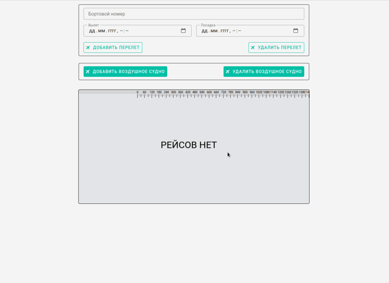

# Приложение визуализации перелетов воздушных судов (Aircraft flights)



[Demo](https://alekstar79.github.io/aircraft-flights)

Реализовано, добавление воздушного судна, добавление перелетов, перетаскиваемое модальное окно с детализацией введенных
данных, по каждому перелету (бортовой номер, время вылета, время прилета, время в пути). Блок визуализации (_HTMLCanvasElement_),
дублирует информацию из полей ввода и модального окна в графическом представлении. Так же присутствуют элементы управления
списком, кнопки - "Добавить судно", "Удалить судно", "Добавить перелет", "Удалить перелет". И временная шкала.

> Примечание:  
> MVP работает на текущую дату. Т.е. ввести данные на предыдущую / последующую дату возможно, но визуального отображения не будет видно.
> Связано это с тем, что не реализована увязка масштабирования с датой, но данная возможность заложена для доработки непосредственно в виде кода.

Технологический стек: Vue.js 3 (Composition API), Vuetify 3, Vuex 4, Fabric.js, Sass.

## Настройка проекта

Клонируйте этот репозиторий:
```shell
git clone git@github.com:alekstar79/aircraft-flights.git
```
Перейдите в каталог проекта:
```
cd aircraft-flights
```
Установите зависимости:
```
yarn install
```
Запуск в режиме разработки
```shell
yarn serve
```
Сборка для продакшена
```
yarn build
```
